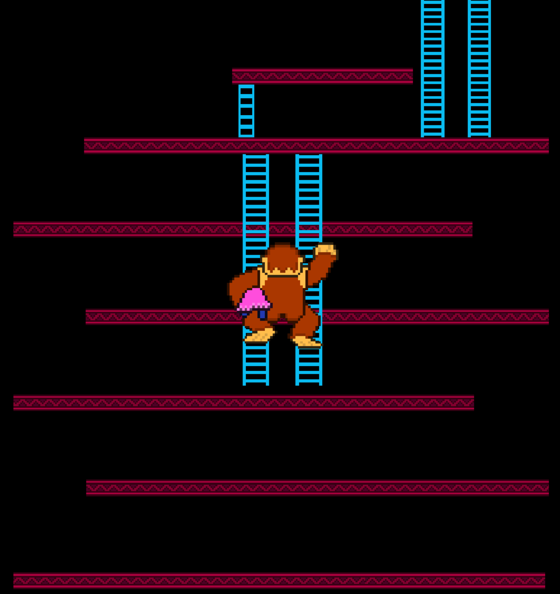
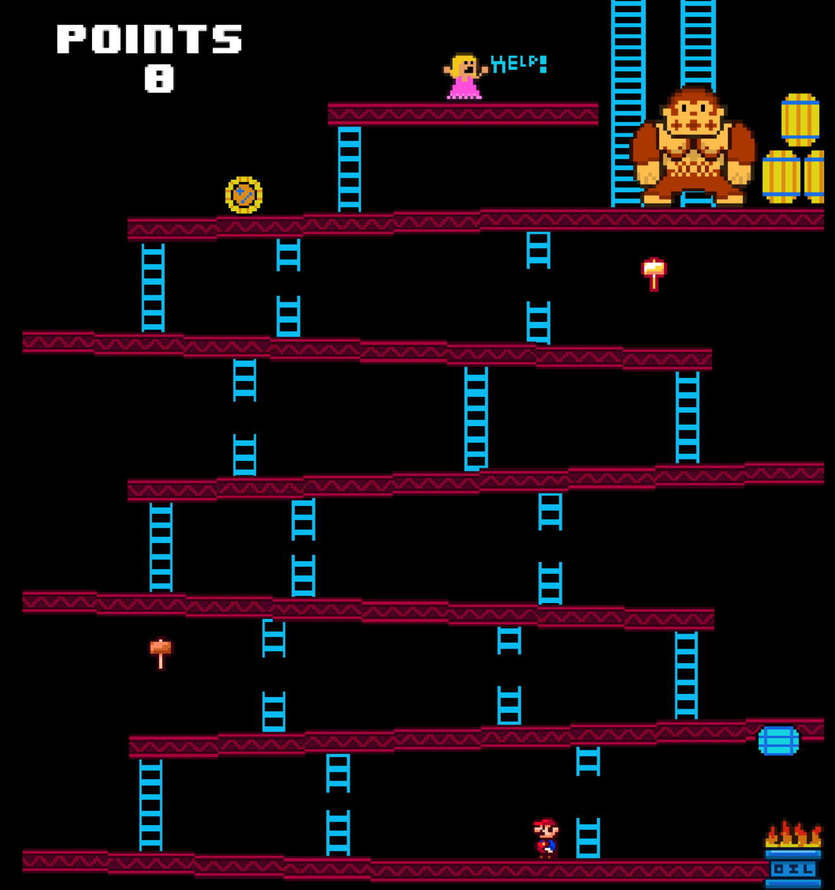
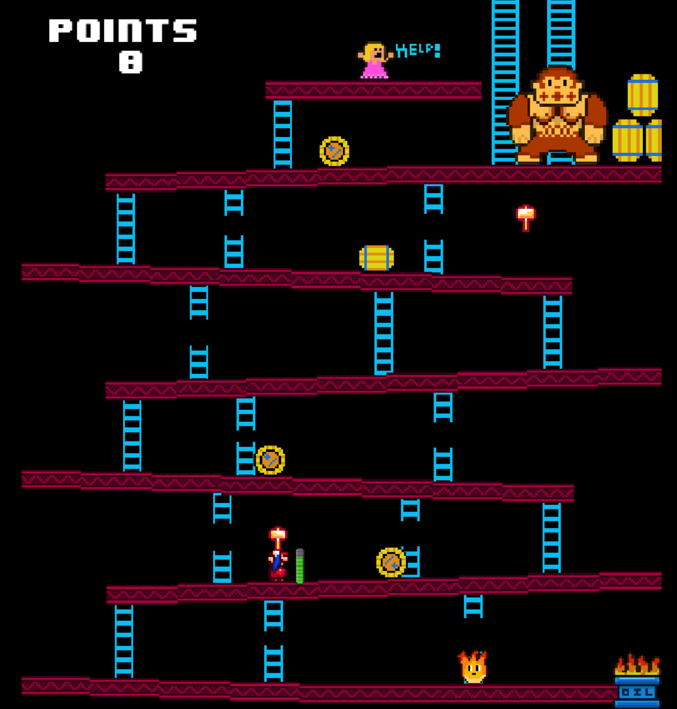

# **DONKEY KONG**
#### GitHub repo: https://github.com/ADOGamedev/Donkey_Kong

#### Description: This is an application made in Godot 3.3.2. It's just a recreation of the original Donkey Kong.

## Controls

- **Space**: jump.

- **S**: when you are above a (not-broken) lader, press S to climb it downwards.
> [!WARNING]
> It might be a little buggy, so don't mess too much with it 😅

- **W**: when you are below a lader, press W to climb it.

## Screenshots

